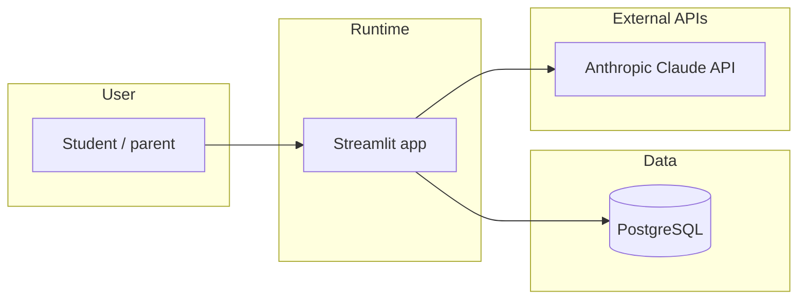
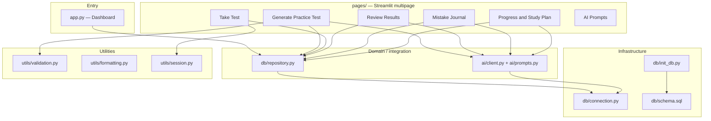
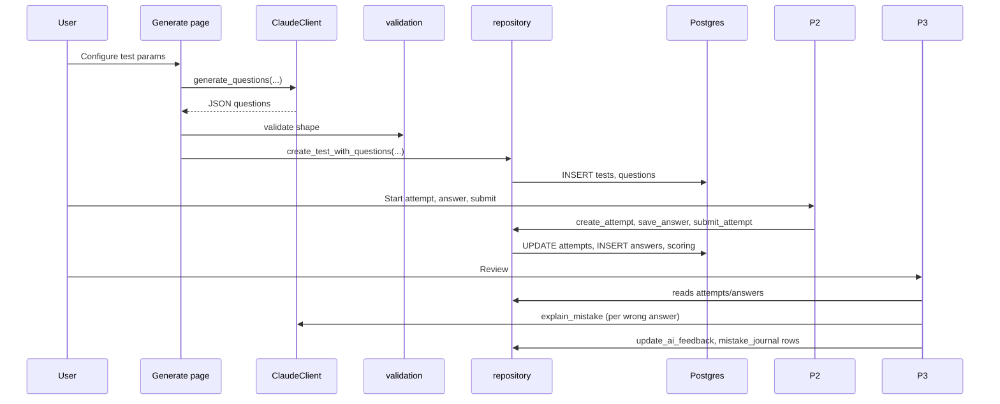
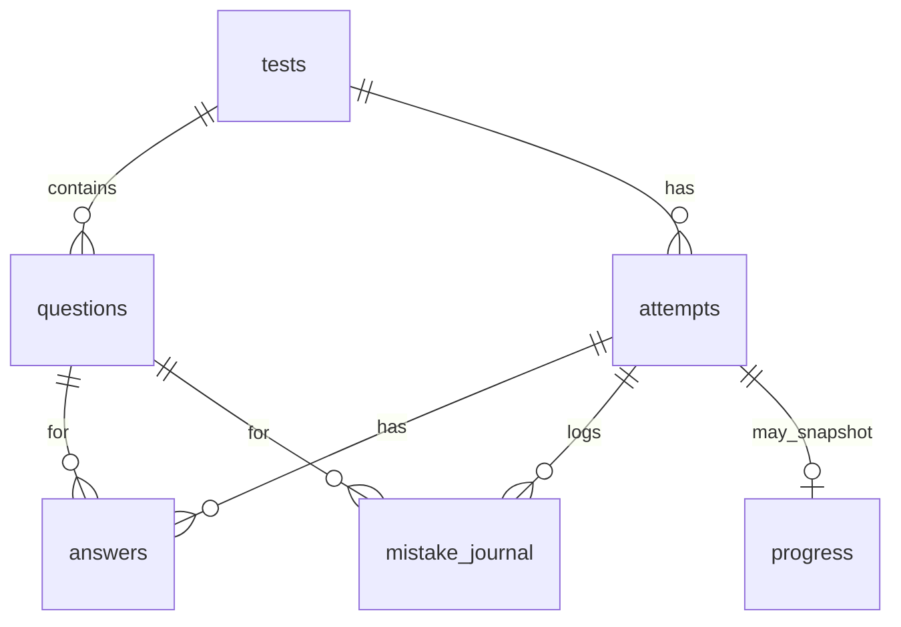

# College Prep AI — Architecture

This document describes how the application is structured, how data flows, and where to extend it. The app is intentionally **small and monolithic**: one Streamlit process, direct SQL, no background workers.

---

## 1. System context

| Actor / system | Role |
|----------------|------|
| **Streamlit** | HTTP UI, routing between multipage scripts, session state |
| **PostgreSQL** | Single source of truth for tests, attempts, answers, mistakes, progress |
| **Claude (Anthropic)** | Question generation, mistake coaching JSON, weekly study plan JSON |

---

## 2. Container view (inside the repo)

---

## 3. Layering and responsibilities

| Layer | Location | Responsibility |
|-------|----------|----------------|
| **Presentation** | `app.py`, `pages/*.py` | Widgets, navigation, calling repository and AI, displaying errors |
| **AI integration** | `ai/client.py` | Anthropic client, JSON extraction from model output |
| **Prompt contracts** | `ai/prompts.py` | Prompt templates; expected JSON shapes documented in README |
| **Persistence** | `db/repository.py` | All SQL: tests, attempts, scoring, mistakes, progress snapshots |
| **DB access** | `db/connection.py` | `DATABASE_URL`, connection context manager (`psycopg`) |
| **Schema** | `db/schema.sql`, `db/init_db.py` | DDL and one-shot init used by dashboard button |
| **Validation** | `utils/validation.py` | Shape checks for generated question payloads before insert |
| **Session** | `utils/session.py` | Keys for in-progress attempt flow (`current_attempt_id`, `question_index`, …) |
| **Formatting** | `utils/formatting.py` | Shared display helpers |

**Rule of thumb:** pages should not embed raw SQL; they call `repository` and `ClaudeClient`. Exceptions should surface to the UI as `st.error` / `st.warning`.

---

## 4. Primary user journeys (data flow)

### 4.1 Generate → take → review

### 4.2 Progress and study plan

- After submissions, repository logic aggregates scores and topics and may **insert `progress` snapshots** (see `repository` helpers around `_insert_progress_snapshot`).
- **Progress & Study Plan** page builds a text summary, calls **`generate_study_plan`**, and displays charts from SQL aggregates.

---

## 5. Database model (logical)

| Table | Purpose |
|-------|---------|
| `tests` | Generated exam metadata (SAT/ACT, section, difficulty, timing) |
| `questions` | Items with `choices` JSONB, key, explanation, topic |
| `attempts` | One run; status, timestamps, score fields |
| `answers` | Per-question response, optional `ai_feedback` JSONB |
| `mistake_journal` | Incorrect items for review / retry-test generation |
| `progress` | Snapshots: aggregates, weak topics, recommendations |

Authoritative DDL: `db/schema.sql`.

---

## 6. Session state (Take Test)

Defined in `utils/session.py` and used heavily by `pages/2_Take_Test.py`:

| Key | Role |
|-----|------|
| `current_attempt_id` | Active attempt |
| `question_index` | Pagination through questions |
| `attempt_started_at` | Timing |
| `test_filters` | UI filters |

`reset_attempt_state()` clears attempt-related keys when starting over.

---

## 7. Configuration

| Variable | Used by | Purpose |
|----------|---------|---------|
| `DATABASE_URL` | `db/connection.py` | Postgres connection string |
| `ANTHROPIC_API_KEY` | `ai/client.py` | Claude API |
| `ANTHROPIC_MODEL` | `ai/client.py` | Model id override |

Copy `.env.example` to `.env` for local development.

---

## 8. Non-goals and constraints

- **No multi-tenant auth** in this codebase: single local/student use case; DB holds all data for that instance.
- **No async job queue**: long Claude calls run in the Streamlit request thread (acceptable for low concurrency).
- **No ORM**: explicit SQL keeps migrations simple (`schema.sql` + `init_db`).
- **No separate API server**: Streamlit is the only HTTP application.

---

## 9. Extension points

| Goal | Suggested approach |
|------|-------------------|
| Multiple students | Add `users` / `student_id` FKs; gate pages by session |
| Auth | Wrap `app.py` / pages with login; store user id on rows |
| Stronger question QA | Post-process in `validation.py` or extra Claude pass |
| Export / reports | New page + read-only queries in `repository` |
| Deploy | Container with `DATABASE_URL` to managed Postgres; same env vars |

---

## 10. Related files

| Document | Content |
|----------|---------|
| `README.md` | Setup, schema summary, prompt JSON examples |
| `db/schema.sql` | Tables and constraints |
| `ai/prompts.py` | Prompt text aligned with JSON contracts |
